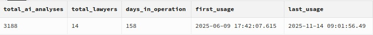
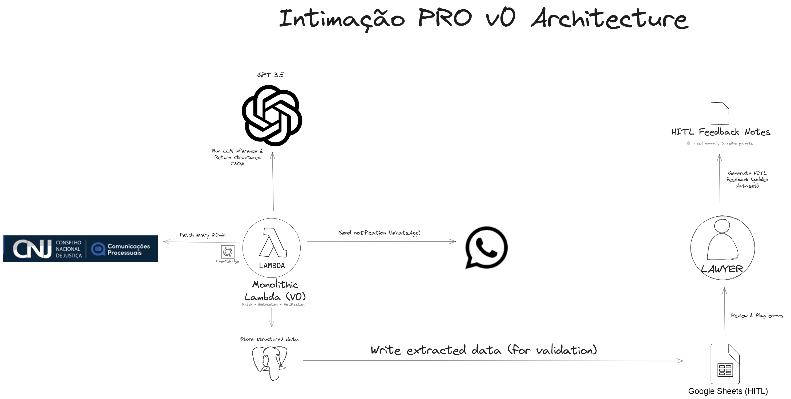
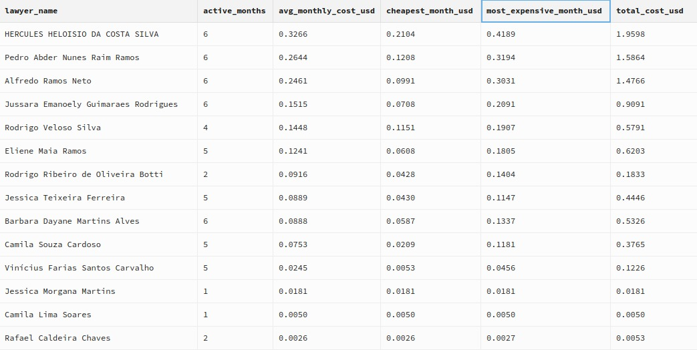
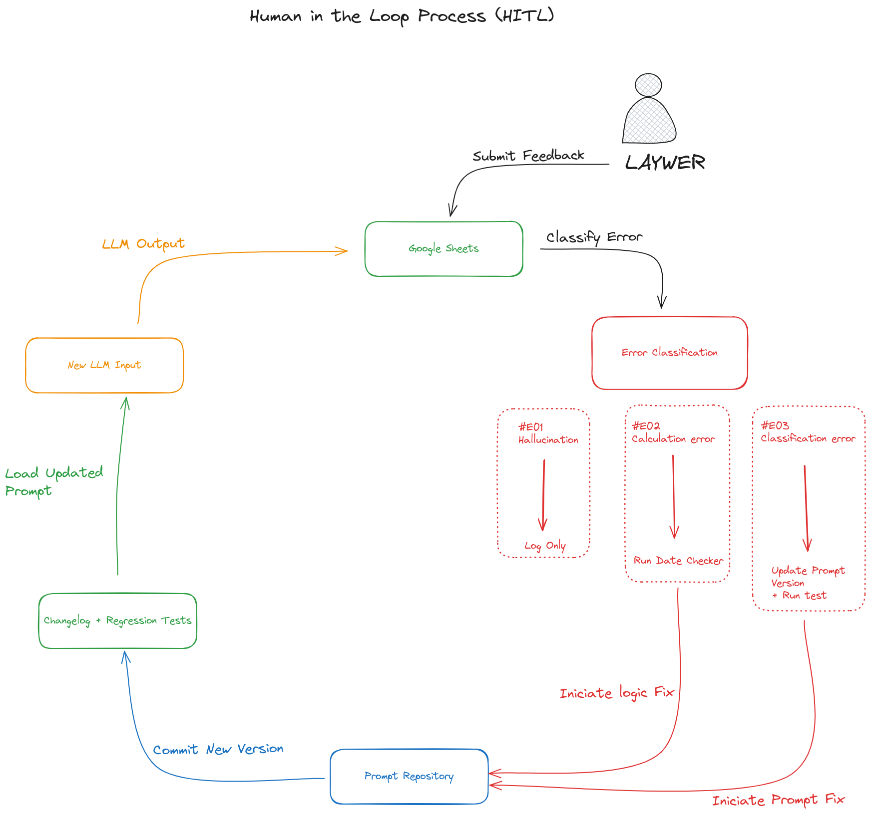
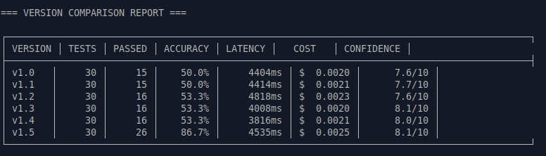
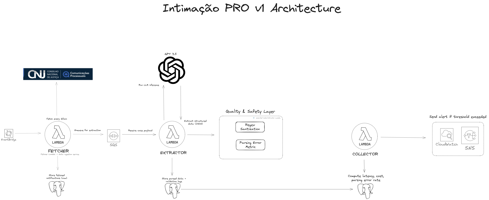
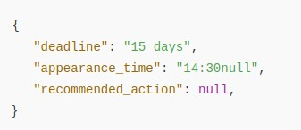
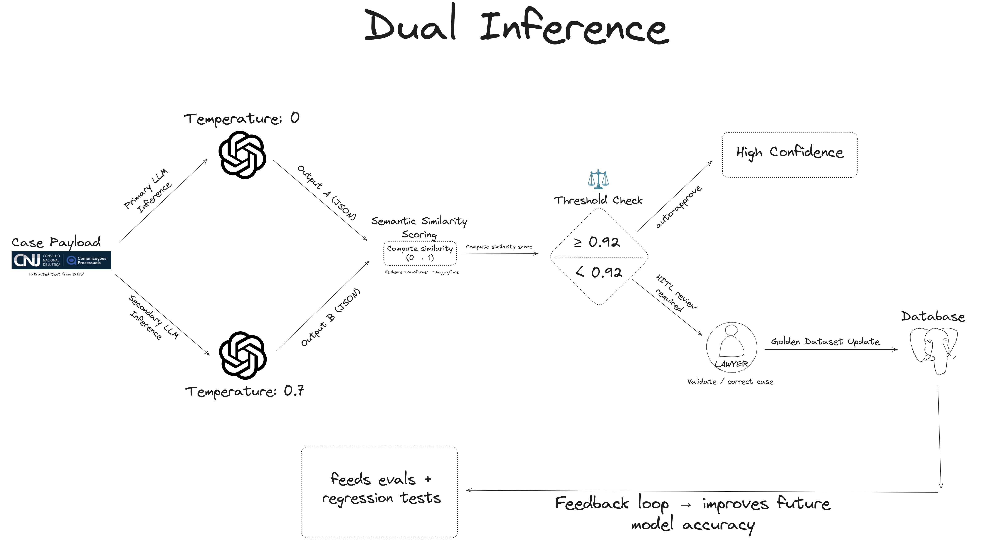

# Intimação Pro: Production LLM System Evolution (v0 → v1)

**From monolith to modular: the architecture, metrics, and engineering decisions behind a legal automation system processing 3,000+ court notifications in production**

> **🔒 Commercial Project Notice**: This repository documents a real production system. Architecture, metrics, and engineering patterns are shared. Proprietary elements (prompts, business logic, client data) remain protected.

---

## 🎯 The Problem & Solution

**The Problem:** Brazilian lawyers waste 30 minutes daily manually checking the Electronic Justice Diary (DJEN) - a government portal without robust APIs. This creates bottlenecks, missed deadlines, and inefficient workflows.

**The Solution:** An AI-powered system that monitors court notifications every 20 minutes, extracts structured information via LLM, calculates legal deadlines, and delivers instant WhatsApp notifications.

**The Impact:** Running in production since June 2025, serving 14 lawyers across 110+ active cases.

## 📊 Production Impact (June - November 2025)

> **Data Period:** June 9, 2025 → November 14, 2025 (5 months in production)

**Key Results:**
- **3,188 notifications** processed automatically
- **14 lawyers** actively using the system
- **158 days** of continuous operation
- **99.22% success rate** in API queries
- **$0.11 USD per lawyer per month** in operational costs
- **900+ hours saved** in manual work

## ⚙️ V0: First Architecture

The initial version was fully serverless - a single AWS Lambda handling the entire pipeline: fetching data from DJEN, extracting information with GPT-3.5-turbo, calculating deadlines, and sending WhatsApp notifications.

A parallel Google Sheets integration enabled lawyers to review extracted data and submit feedback, creating a human-in-the-loop validation cycle that became the foundation of our continuous improvement process.

### Production Metrics

The system demonstrated strong reliability and cost-efficiency in production:

**Performance Highlights:**
- **99.22% success rate** across 5,288 API requests
- **95ms average response time** with 99.30% under 500ms
- **$0.11 per lawyer per month** in operational costs

### HITL & Prompt Evolution

Lawyers flagged edge cases directly in Google Sheets, classifying errors as hallucinations, date miscalculations, or incorrect action recommendations. These validated cases formed a golden dataset used to evaluate every new prompt version through systematic regression testing.

This feedback loop enabled systematic prompt improvements, with accuracy evolving from 50.0% (v1.0) to 86.7% (v1.5) across 30 standardized test cases covering deadline extraction, action recommendations, procedural categorization, and instance detection.

## 🚨 Challenges Identified

Running in production revealed three critical limitations that required architectural evolution:

- **Scalability:** Monolithic Lambda couldn't handle multiple clients without downtime risk
- **Quality & Safety:** No input sanitization or structured validation before LLM processing  
- **Human Overload:** Every edge case required manual validation, creating bottlenecks

## 🔄 V1: Engineering Evolution (Blueprint)

From production learnings, I designed a modular architecture focused on scalability, cost efficiency, and quality assurance. The monolithic Lambda was split into three specialized functions connected through SQS queues for reliability and traceability.

### Modular Architecture

**Fetch Lambda:** Retrieves court notifications every 20 minutes via EventBridge. Isolates data-fetching from processing, enabling independent retry logic and easier monitoring of DJEN API health.

**Extractor Lambda:** Cleans notification text, runs the LLM extraction, validates JSON structure, and records parsing errors for accuracy tracking. Implements regex-based input sanitization to detect prompt injections before model execution.

**Metrics Lambda:** Collects production metrics (latency, cost, parsing errors) and sends CloudWatch alerts when thresholds are exceeded. Provides real-time visibility into system health and cost anomalies.

### Quality & Safety Layer

Input sanitization with regex patterns detects malformed text and potential prompt injections before LLM processing, protecting against adversarial inputs.

A new **Parsing Error Rate** metric tracks invalid JSON responses from the model - the key accuracy signal in production. When structure breaks, the system flags or retries automatically.

Combined with CloudWatch alerts and OpenTelemetry traces, this layer transforms raw model calls into measurable, auditable events.

### Dual-Inference Pattern

To reduce human validation overhead while maintaining quality, the system implements dual-inference for edge cases: two model calls with different temperatures compute semantic similarity using a Sentence Transformer model (HuggingFace via LangChain).

When similarity drops below threshold, the case routes to human validation. This creates a lightweight validation pipeline that feeds the golden dataset, improving future accuracy through continuous evals and regression tests.

## 💬 WhatsApp Conversational Agent

Beyond automated notifications, the system supports natural language queries via WhatsApp, demonstrating early AI agent capabilities:

Lawyers can ask "What are my deadlines for tomorrow?" or "When is my next hearing?" and receive instant, context-aware responses powered by GPT-3.5 with database integration.

## 🔮 Future Roadmap

V1 implementation is scheduled for Q1 2026, with planned enhancements including:

- **Modular deployment** of the three-Lambda architecture with SQS integration
- **Production deployment** of dual-inference pattern for edge case detection
- **RAG integration** to augment context with archived legal documents
- **Multi-client scalability** testing with 50+ concurrent lawyers
- **Advanced observability** with OpenTelemetry and CloudWatch dashboards

The vision is to evolve into an autonomous legal agent capable of operating at 98%+ accuracy without human validation for standard notifications.

---

## 🔗 Resources

- **[Technical Walkthrough (Loom)]** - Video walkthrough of architecture and implementation *(coming soon)*
- **[Torre Inteligência](https://www.torreinteligencia.com.br)** - Production system website

---

## 📝 Notes

**Privacy:** All data is public and directly available on the DJEN website. No authentication required, no sensitive information processed.

**Status:** V0 is in production serving 14 lawyers. V1 blueprint is ready for implementation.

**Contact:** Questions or technical inquiries: [hi@pdrobrandao.com](mailto:hi@pdrobrandao.com) | [pdrobrandao.com](https://www.pdrobrandao.com/)

