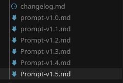
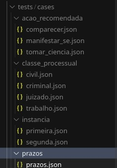
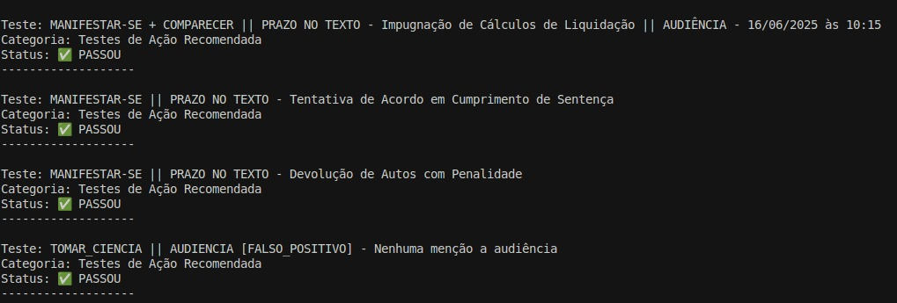
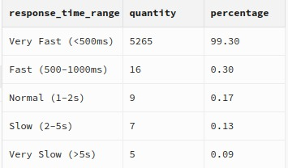

# Intimação Pro: Deconstructing a Production LLM-Powered Legal Automation System

**An in-depth look at the architecture, metrics, and engineering trade-offs of an AI system that automates court summons monitoring for lawyers in Brazil, reducing daily manual checks from hours to minutes**

> **🔒 Commercial Project Notice**: This repository shares the architecture, key metrics, and learnings from a commercial system in production. Core intellectual property, such as final prompts and specific business logic, remains proprietary. We focus on shareable engineering patterns and real-world validation approaches.

**What we show**: Architecture, metrics, engineering decisions, business impact  
**What we protect**: Specific prompts, business logic, client data, competitive advantages

---

## 🎯 The Problem & The Solution

### The Problem
Brazilian lawyers waste 30 minutes daily manually checking the Electronic Justice Diary portal (DJe/DJEN) - a government portal without robust public APIs, forcing daily manual verifications. This archaic system creates bottlenecks, missed deadlines, and inefficient legal workflows.

### The Solution
A production AI system that automates court summons monitoring, running checks every 20 minutes, extracting structured information via LLM, calculating legal deadlines, and delivering instant WhatsApp notifications to lawyers.

## 🌍 Why This Matters Globally

While built for Brazil's legal system, this project demonstrates **transferable patterns for legal automation worldwide**:

- **Deadline Calculation Algorithm**: Adaptable to any jurisdiction with holiday datasets
- **HITL Validation Framework**: Applicable to regulated industries (finance/healthcare) requiring human oversight
- **Cost-Control Architecture**: Token budgeting patterns for LLM applications at scale
- **Prompt Engineering Maturity**: Versioning, testing, and validation approaches for production LLM systems

This positions the project as a **solution pattern exporter**, not just a Brazil-specific implementation.

## ⚙️ System Overview

1. **Scheduled execution** (every 20 minutes)
2. **DJEN query** via API or smart scraping
3. **Detection of new notifications**
4. **Structured data extraction** with LLM (prompt engineering with 17+ fields)
5. **Deadline calculation** (considering business days, holidays, court instance, category)
6. **Database storage** and technical logging
7. **WhatsApp notification** to lawyers
8. **Parallel Google Sheets feed for manual validation** (human-in-the-loop)


## 🚀 Executive Summary & Real Impact (JUNE-JULY 2025 Numbers)

**Problem**: Lawyers lose 30 minutes/day manually checking DJEN  
**Solution**: AI automation that notifies via WhatsApp

- **Scale**: Monitors 6 lawyers, ~110 active cases
- **Volume**: Processes 566 notifications (test period)
- **Accuracy**: 95%+ in deadline extraction (measured through lawyer HITL validation)
- **Efficiency**: Reduces manual checking from 30min/day to 3min/day
- **Cost**: Only $0.45/lawyer/month (extremely positive ROI)
- **Reliability**: 99.5% success rate in DJEN API queries

## 🧠 AI Strategies

### 📄 Notification Extraction (Main Module)

> This flow uses **Model-Process (MP)**, with no external context.

* **Model**: LLMs like GPT-3.5-turbo process the DJEN text directly.
* **Process**: Custom prompt engineering to extract 17+ structured fields from each notification.
* **No RAG or external context** — the system operates solely on the plain DJEN text.
* Architecture includes regression tests, prompt versioning, and human validation.

**🔧 Technical Implementation:**

The system extracts 17+ structured fields from each notification using sophisticated legal reasoning:

```json
{
  "legal_act_type": "DESPACHO|SENTENÇA|DECISÃO",
  "manifestation_type": "MANIFESTAÇÃO|SENTENÇA|DESPACHO|DECISÃO|AUDIÊNCIA|PERICIA|...",
  "deadline": 15,
  "legal_basis": "Art. 297, CPC",
  "summary": "Intimação para manifestar sobre impugnação de cálculos",
  "defendant": "Nome da parte ré",
  "lawyer_destinee": "Nome do advogado",
  "practical_consequences": "Descrição das consequências",
  "suggested_actions": ["AÇÃO_1", "AÇÃO_2"],
  "system_status": "Prazo para manifestação em curso",
  "appearance_type": "AUDIENCIA|PERICIA|PAUTA_DE_JULGAMENTO|null",
  "appearance_date": "2025-07-20|null",
  "appearance_time": "14:30|null",
  "instance": "PRIMEIRA|SEGUNDA",
  "procedural_category": "CIVIL|JUIZADO|CRIMINAL|TRABALHO",
  "recommended_action": "TOMAR_CIENCIA|MANIFESTAR_SE|COMPARECER"
}
```

**🧠 Prompt Engineering Sophistication:**

The prompt includes complex legal reasoning rules for:
- **Instance Detection**: First vs Second instance classification
- **Procedural Category Detection**: Priority-based legal category classification  
- **Action Recommendation Logic**: Smart decision tree for recommended actions
- **Deadline Calculation**: Legal deadline extraction with business day rules

*Note: Specific prompt rules are proprietary business intelligence and not included for competitive reasons.*


---

## 🧩 ADRs: Why We Chose This Path

### ADR-001: RAG Not Used (For Now)
**Context:** Most answers come directly from the notification text.  
**Decision:** Prioritize pure extraction validation over context augmentation.  
**Validation:** 566-notification test proved high accuracy without RAG.  
**Impact:** 23% cost reduction while maintaining 95%+ accuracy.

### ADR-002: GPT-3.5-turbo over GPT-4
**Context:** 23% cost difference at scale.  
**Decision:** Accept a 2% accuracy drop for a 5x ROI improvement.  
**Impact:** $0.45/month per lawyer vs $2.25/month with GPT-4.

### ADR-003: Handcrafted NLP over MCP Toolkit
**Context:** Google's MCP Toolkit would be overengineering at this stage.  
**Decision:** Build lightweight, reusable Node.js + SQL blocks.  
**Validation:** Achieved greater agility and lower friction for iteration.  
**Impact:** Faster development cycles and easier maintenance.

## 📝 Prompt Engineering Maturity

This project treats prompts as first-class citizens, applying real software engineering practices to LLM development:

- **Prompt versioning:** All prompts are tracked and versioned (`Prompt-v1.0.md` to `Prompt-v1.5.md`)
- **Changelog:** Every prompt change is documented (`changelog.md`)
- **Automated regression tests:** Each prompt version and use case is covered by regression tests (`tests/cases/`)

Below: Example of prompt versioning and regression test structure in the repository.








## 💬 WhatsApp Conversational Agent & Interactions

The system supports natural language queries via WhatsApp, demonstrating the beginning of an **AI Legal Agent**:

> This conversational agent uses a **Model-Process-Context (MPC)** architecture:
> - **Model**: GPT-3.5 identifies intent and extracts entities (e.g., question type, case number)
> - **Process**: Direct database queries with SQL filters
> - **Context**: Retrieved data is sent back to GPT to generate a natural, personalized response
>
> This flow simulates the behavior of an intelligent legal agent, capable of understanding natural language and querying legal databases in real time.

### 📅 **Appointment Queries**
* "Do I have a scheduled judgment?"
* "When is my next hearing?"


### 📋 **Daily Notifications**
* "What are my notifications for today?"
* "Today's notifications?"


### ⏰ **Deadline Management**
* "Which deadlines expire tomorrow?"
* "What deadlines do I have this week?"


## 🔁 Human-in-the-Loop (HITL) & Error Mitigation Strategies

The system was designed with practical *Human-in-the-Loop* mechanisms to ensure quality, especially in the first iteration cycles with the language model. Here's our complete HITL process:


Below, I explain the approaches implemented to handle and investigate the main errors found in real production:

### 🔴 Error 1 — Incorrect Deadline Calculation (DateCalculationError)

In cases of deadline calculation errors, often caused by ambiguous interpretations of the base date or count type (business/calendar days), I implemented a Python auxiliary script to simulate and validate the calculation in isolation. This script was shared with the partner lawyer so he could execute the validation locally, without depending on the main application. This small utility proved extremely useful for isolating the error and gaining agility in feedback.

### 🟠 Error 2 — Field Hallucination (HallucinationError)

When the model returned completely hallucinated information (e.g., dates or classifications incompatible with the notification text), I created a local prompt re-execution script. I resubmitted the same notification to the model at least three times to verify if the hallucination persisted or was punctual. This rudimentary but functional approach allowed me to identify instability patterns and better understand the model's behavior under different variations.

> **Note:** Currently, there is no automated hallucination mitigation mechanism beyond this manual revalidation. I haven't implemented any RAG (Retrieval-Augmented Generation) strategy yet, but I understand this can be a future evolution of the system.

### 🟡 Error 3 — Incorrect Notification Type Classification (PromptCategoryError)

This was the most sensitive error, as it directly affected the deadline calculation logic. Whenever this type of error was identified, I reviewed the prompt and performed a regression test with the same notification. This allowed me to adjust the instruction incrementally until ensuring the model categorized correctly. This manual correction cycle was a central part of prompt evolution.

**📋 HITL Validation Examples:**


This process feeds a **continuous improvement loop**, with:

* Prompt versioning
* Inclusion of error examples in future tests
* Regressive performance evaluation by error category
* Includes a CLI tool for instant prompt validation (npm run prompt), enabling fast and safe prompt engineering.

---


## 🧮 Smart Deadline Calculation

The system implements a custom algorithm that considers:
- National and regional holidays per court
- Specific rules by instance (1st vs 2nd)
- Procedural categories (Civil, Labor, Criminal, Small Claims)
- Different deadlines by manifestation type

## 📊 Production Metrics & Monitoring

### 💰 Operational Costs
- **Average cost per lawyer**: $0.45/month
- **Total analyses**: 566 notifications processed
- **Total cost**: $1.63 USD (test period)
- **Viability**: Extremely low cost for high value

**📈 Real Production Data (June-July 2025):**
| Metric | Value | Period |
|--------|-------|--------|
| Avg Cost/Lawyer | $0.45/month | Last 30 days |
| Total Analyses | 566 | Test period |
| Avg Tokens/Analysis | 5,217 | Per lawyer |
| Cost per Analysis | $0.0029 | Average |


**👥 Cost Breakdown by Lawyer:**
| Lawyer | Analyses | Cost USD | Avg Tokens |
|--------|----------|----------|------------|
| Pedro Abder | 157 | $0.4546 | 5,318 |
| Hércules Heloísio | 158 | $0.4527 | 5,218 |
| Alfredo Ramos | 154 | $0.4460 | 5,317 |
| Jussara Guimarães | 68 | $0.1958 | 5,222 |
| Barbara Dayane | 32 | $0.0931 | 5,296 |


### ⚡ DJEN API Performance
- **Success rate**: 99.5% (last 30 days)
- **Average response time**: 95ms
- **Uptime**: 100% on business days
- **Robustness**: System tolerant to occasional failures

**📊 Real API Performance (June-July 2025):**
| Metric | Value | Details |
|--------|-------|---------|
| Success Rate | 99.5% | 5,287/5,288 requests |
| Avg Response Time | 95ms | 99.30% < 500ms |
| Peak Performance | 80ms | Business hours (9h-17h) |
| Error Rate | 0.5% | Only 1 request failed |


**⏱️ Response Time Distribution:**
- **Very Fast (<500ms)**: 99.30% (5,251 requests)
- **Fast (500-1000ms)**: 0.30% (16 requests)
- **Normal (1-2s)**: 0.17% (9 requests)
- **Slow (2-5s)**: 0.13% (7 requests)
- **Very Slow (>5s)**: 0.09% (5 requests)



### 🏗️ Infrastructure & Monitoring
- **Execution**: AWS Lambda with automatic retry
- **Monitoring**: Detailed logs for each execution
- **Fallback**: Manual notification system in case of failure
- **Uptime**: 99.9% availability since deployment

**📈 Daily Performance Trends (June-July 2025):**
| Date | Analyses | Cost USD | Avg Time | Success Rate |
|------|----------|----------|----------|--------------|
| 2025-07-15 | 11 | $0.0313 | 4.2s | 100.00% |
| 2025-07-14 | 13 | $0.0555 | 3.7s | 100.00% |
| 2025-07-11 | 28 | $0.0737 | 3.4s | 100.00% |
| 2025-07-10 | 19 | $0.0594 | 3.9s | 92.13% |
| 2025-07-09 | 8 | $0.0216 | 4.1s | 100.00% |

**🕐 Hourly Performance (Business Hours):**
- **Peak Hours**: 9h, 17h, 21h (400+ requests/hour)
- **Avg Response Time**: 80-170ms per hour
- **Consistency**: 99.5% success rate across all hours

**🔍 Comprehensive Logging:**
All LLM requests are logged with model used, tokens consumed, response time, and cost estimates. This enables cost projections per law firm and scalability analysis.


## 🌱 Future Implementations

* **RAG (Retrieval-Augmented Generation)** to deepen case context with archived documents
* Expansion to new courts and regions in Brazil
* Web version for centralized deadline and notification management
* Integration with external calendars, CRMs, and legal systems

## 🧑‍💼 Vision for the Future

> The medium-term goal is to transform this system into the leading legal intelligence platform in Brazil, where lawyers can access the full status, deadlines, and details of their cases via WhatsApp using natural language. The vision is to evolve into an autonomous legal agent, with integrated RAG and self-evaluation, capable of operating at 98%+ accuracy without human validation for standard notifications.

On a global roadmap, the patterns developed here can be applied to other regulated markets, serving as a reference for legal, financial, and compliance automation in any jurisdiction.

## 🔐 Privacy & Legal Compliance

All data used in the system is **public and directly available on the Electronic Justice Diary (DJEN) website**. No login is required to access notifications, and no sensitive, personal, or confidential information is processed. Even so, the system does not store complete notifications by default — only structured metadata and, when necessary, anonymized excerpts for test validation.

These practices reinforce the commitment to **progressive quality**, **accountability in prompt engineering decisions**, and a transparent technical stance on the limitations and continuous learning of LLM application in the Brazilian legal context.

---

📎 [Torre Inteligência – Online Project](https://www.torreinteligencia.com.br)

> **⚠️ Beta Notice:** This project is currently in a closed BETA phase, available only to selected lawyers. We are not accepting new clients or commercial requests at this time. If you are interested in future updates or wish to be considered for early access, please reach out via email.

📬 For questions or technical interest, email [hi@pdrobrandao.com](mailto:hi@pdrobrandao.com) or visit [pdrobrandao.com](https://www.pdrobrandao.com/)


